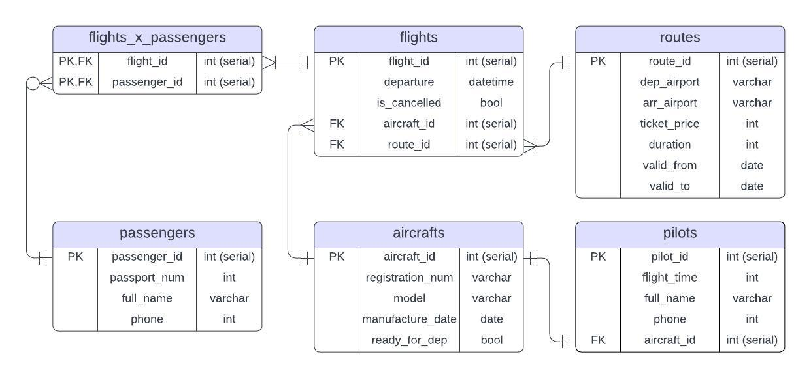

# 1. Защита темы  
Предметная область - авиакомпания  
Сущности:  
- рейс (flight)  
- пилот (pilot)  
- маршрут (route)  
- пассажир (passenger)  
- самолет (aircraft)  

# 2. Концептуальная модель  
  
  
• Каждый рейс проходит ровно по одному маршруту, а по одному маршруту могут осуществляться один или несколько рейсов  
• Пассажир может купить билеты на несколько рейсов, причем обязательно - хотя бы на один (иначе система бронирования не занесет его в базу). Один рейс может перевозить любое кол-во пассажиров (если пассажиров 0, это допустимо, и тогда рейс отменится)  
• Самолет назначается на один или несколько рейсов, а на рейс назначается ровно один самолет  
• У самолета ровно один пилот, причем каждый пилот закреплен за каким-то одним самолетом  
  
# 3. Логическая модель  
  
  
Нормализация: БД в 3НФ, поэтому добавлена таблица flights_x_passengers. 3НФ удобна тем, что каждый неключевой атрибут «должен предоставлять информацию о ключе, полном ключе и ни о чём, кроме ключа», что помогает лаконично представлять описание всех сущностей  
Версионирование: в таблице маршрутов (routes) используется SCD2, т.е. при изменении данных в таблицу добавяется новая строка. Для маршрутов допустимы редкие, но существенные изменения, историю которых было бы полезно отслеживать  
  
# 4. Физическая модель  
  

# 5. Реализация схемы с помощью DDL-скриптов  
create_schema.sql

# 6. Заполнение схемы данными с помощью DML-скриптов или прочтения CSV  
data/*.csv

# 7. 10 осмысленных запросов + описание желаемого вывода  
